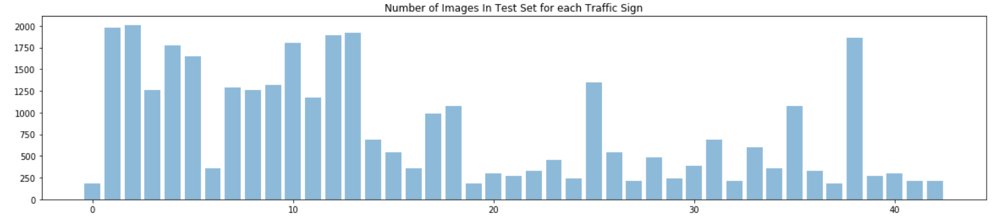

# **Traffic Sign Recognition** 

## Writeup

---

**Build a Traffic Sign Recognition Project**

The goals / steps of this project are the following:
* Load the data set (see below for links to the project data set)
* Explore, summarize and visualize the data set
* Design, train and test a model architecture
* Use the model to make predictions on new images
* Analyze the softmax probabilities of the new images
* Summarize the results with a written report

[//]: # (Image References)

[image1]: ./examples/visualization.jpg "Visualization"
[image2]: ./examples/grayscale.jpg "Grayscaling"
[image3]: ./examples/random_noise.jpg "Random Noise"
[image4]: ./examples/placeholder.png "Traffic Sign 1"
[image5]: ./examples/placeholder.png "Traffic Sign 2"
[image6]: ./examples/placeholder.png "Traffic Sign 3"
[image7]: ./examples/placeholder.png "Traffic Sign 4"
[image8]: ./examples/placeholder.png "Traffic Sign 5"

## Rubric Points
### Here I will consider the [rubric points](https://review.udacity.com/#!/rubrics/481/view) individually and describe how I addressed each point in my implementation.  

---
### Writeup / README

#### 1. Provide a Writeup / README that includes all the rubric points and how you addressed each one. You can submit your writeup as markdown or pdf. You can use this template as a guide for writing the report. The submission includes the project code.

You're reading it! and here is a link to my [*git fork*](https://github.com/game-of-drones/CarND-Traffic-Sign-Classifier-Project/blob/master/Traffic_Sign_Classifier.ipynb)

---
### Data Set Summary & Exploration

#### 1. Provide a basic summary of the data set and identify where in your code the summary was done. In the code, the analysis should be done using python, numpy and/or pandas methods rather than hardcoding results manually.

I used the *numpy* library to calculate summary statistics of the traffic
signs data set:

* Number of training examples = 34799
* Number of validating examples = 4410
* Number of testing examples = 12630
* Image data shape = (32, 32)
* Number of classes = 43

#### 2. Include an exploratory visualization of the dataset and identify where the code is in your code file.

* First, I imported the signnames.csv file, and created a label_to_name `map`. 
* Then, for each label, I randomly chose one image for each label and plotted them with corresponding name.
* Finally, I use a bar chart to plot the number of images for each traffic sign in the training set. As we can see, the distribution of number of samples is not very uniform.

---
### Design and Test a Model Architecture

#### 1. Describe how, and identify where in your code, you preprocessed the image data. What tecniques were chosen and why did you choose these techniques? Consider including images showing the output of each preprocessing technique. Pre-processing refers to techniques such as converting to grayscale, normalization, etc.

The code for this step is contained in the `Pre-process the Data Set` Section of the IPython notebook.

[//]: # (As a first step, I decided to convert the images to grayscale because ... Here is an example of a traffic sign image before and after grayscaling. ![alt text][image2])

[//]: # (As a last step, I normalized the image data because ...)

Initially I tried to convert the images to grayscale and train the LeNet. However, the accuracy was not very satisfactory. As a result, I decided to train the net with colored image directly. 

I first use a simple normalization method, i.e. image = image/128.0 - 1.0 to get the value of each pixel to between -1 and 1. The resulting validation accuracy was around 0.93.

Later, I use function exposure.equalize_adapthist from skimage, and my resulting validating accuracy goes above 0.95. The drawback is that this function is very slow to run. So I had to save the normalized image in a pickle file.

#### 2. Describe how, and identify where in your code, you set up training, validation and testing data. How much data was in each set? Explain what techniques were used to split the data into these sets. (OPTIONAL: As described in the "Stand Out Suggestions" part of the rubric, if you generated additional data for training, describe why you decided to generate additional data, how you generated the data, identify where in your code, and provide example images of the additional data)

[//]: # (The code for splitting the data into training and validation sets is contained in the fifth code cell of the IPython notebook.)  

[//]: # (To cross validate my model, I randomly split the training data into a training set and validation set. I did this by ...)

Different from the MNIST example in the LeNet lab, there is already validation data in the downloaded image set. 

My final training set had 34799 images. My validation set and test set had 4410 and 12630 images, respectively.

#### 3. Describe, and identify where in your code, what your final model architecture looks like including model type, layers, layer sizes, connectivity, etc.) Consider including a diagram and/or table describing the final model.

My final model consisted of the following layers:

| Layer                 |     Description                               | 
|:---------------------:|:---------------------------------------------:| 
| Input                 | 32x32x3 RGB image                             | 
| Convolution 5x5       | 1x1 stride, VALID padding, outputs 28x28x6    |
| Activation: RELU      |                                               |
| Max pooling           | 2x2 stride,  outputs 14x14x6                  |
| Dropout               | Keep Probability 0.707                        |
| Convolution 5x5       | 1x1 stride, VALID padding, outputs 10x10x16.  |
| Activation: RELU      |                                               |
| Max pooling           | 2x2 stride,  outputs 5x5x16                   |
| Dropout               | Keep Probability 0.707                        |
| Fully connected 1     | output: 120                                   |
| Fully connected 2     | output: 84                                    |
| Fully connected 3     | output: 43 (=n\_class)                        |
| Softmax               | etc.                                          |

Note that I added dropout at the convolution layers.

#### 4. Describe how, and identify where in your code, you trained your model. The discussion can include the type of optimizer, the batch size, number of epochs and any hyperparameters such as learning rate.

See the `Train, Validate and Test the Model` section for the code.

Training the model is the process of minimizing a cost function. From the following definition, we can see clearly that we are minimizing the mean of cross entropy between the softmax of logits and the one hot of labels.

 > cross\_entropy = tf.nn.softmax\_cross\_entropy\_with\_logits(logits=logits,labels=one\_hot\_y)
 >
 > loss\_operation = tf.reduce\_mean(cross\_entropy)
 >
 > optimizer = tf.train.AdamOptimizer(learning\_rate=rate)
 >
 > training\_operation = optimizer.minimize(loss\_operation)

To train the model, we go through the training set multiple times (defined in EPOCHS). In each epoch, we take a small batch (size defined in BATCH\_SIZE) of input data, run the optimization to update the parameters a little bit (defined by learning rate), and repeat on the next small batch till we finished the data set.

In my model, the hyper parameters I used are:
* BATCH_SIZE = 128
* EPOCHS = 25
* rate = 0.001*0.8
* sigma = 0.075

#### 5. Describe the approach taken for finding a solution. Include in the discussion the results on the training, validation and test sets and where in the code these were calculated. Your approach may have been an iterative process, in which case, outline the steps you took to get to the final solution and why you chose those steps. Perhaps your solution involved an already well known implementation or architecture. In this case, discuss why you think the architecture is suitable for the current problem.

My final model results were:
* training set accuracy of 0.994
* validation set accuracy of 0.944
* test set accuracy of 0.947

If an iterative approach was chosen:
* What was the first architecture that was tried and why was it chosen?
* What were some problems with the initial architecture?
* How was the architecture adjusted and why was it adjusted? Typical adjustments could include choosing a different model architecture, adding or taking away layers (pooling, dropout, convolution, etc), using an activation function or changing the activation function. One common justification for adjusting an architecture would be due to over fitting or under fitting. A high accuracy on the training set but low accuracy on the validation set indicates over fitting; a low accuracy on both sets indicates under fitting.
* Which parameters were tuned? How were they adjusted and why?
* What are some of the important design choices and why were they chosen? For example, why might a convolution layer work well with this problem? How might a dropout layer help with creating a successful model?

I first follows the instructions to do both gray scale and normalization on the image. However, the validation accuracy is only something like 0.8. I decided to use colored image directly. I'll need to investigate grayscale later, since I saw someone got good result with grayscale on slack.

I used the LeNet structure in the lecture, adding dropout at each convolution layer. Dropout is supposed to give more robust result and avoid overfitting.

If a well known architecture was chosen:
* What architecture was chosen?
* Why did you believe it would be relevant to the traffic sign application?
* How does the final model's accuracy on the training, validation and test set provide evidence that the model is working well?
 
 I didn't use other architecture. Just added dropouts, as stated above. Also, as mentioned above, using skimage.exposure.equalize_adapthist to normalize the data helped quite a lot.

---
### Test a Model on New Images

#### 1. Choose five German traffic signs found on the web and provide them in the report. For each image, discuss what quality or qualities might be difficult to classify.

Here are five German traffic signs that I found on the web:

* The second image might be difficult to classify. It's squeezed in the vertical direction since the image is taken with an angle.
* The third and fifth images have watermarks on them, so it might cause some trouble to the model.
* The sign in the fourth image is somewhat worn out, and slightly over exposed at some region. This might be an issue to the model.

#### 2. Discuss the model's predictions on these new traffic signs and compare the results to predicting on the test set. Identify where in your code predictions were made. At a minimum, discuss what the predictions were, the accuracy on these new predictions, and compare the accuracy to the accuracy on the test set (OPTIONAL: Discuss the results in more detail as described in the "Stand Out Suggestions" part of the rubric).

Here are the results of the prediction:

| Image                   |     Prediction                        | 
|:-----------------------:|:-------------------------------------:| 
|1. RightofWay next inter | RightOfWay next intersection          | 
|2. SpdLmt 50 km/h        | SpdLmt 30 km/h                        |
|3. Caution               | Caution                               |
|4. Road Work             | SpdLmt 80 km/h                        |
|5. 30 km/h               | SpdLmt 30 km/h                        |

The model was able to correctly guess 3 of the 5 traffic signs (sign 1, 3, and 5), which gives an accuracy of 60%.

#### 3. Describe how certain the model is when predicting on each of the five new images by looking at the softmax probabilities for each prediction and identify where in your code softmax probabilities were outputted. Provide the top 5 softmax probabilities for each image along with the sign type of each probability. (OPTIONAL: as described in the "Stand Out Suggestions" part of the rubric, visualizations can also be provided such as bar charts)

The following image shows, for each picture downloaded from internet, the probability of the top 5 predictions.

 
 
* For the first image, the model predicts correctly with very high confidence (almost 100%). 
* For the second image, the model predicts incorrectly, with a relatively high confidence.
* For the third image, the model predicts correctly with a relatively high confidence.
* For the fourth image, the model predicts incorrectly. The correct answer only ranks number 3.
* For the fifth image, the model predicts correctly with a  high confidence.